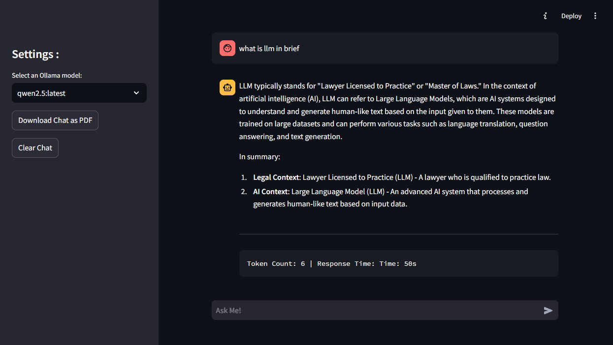

# Chat with Ollama - Streamlit UI

This project is a simple Streamlit-based web application that allows users to chat with the Ollama AI model. It integrates Ollama locally, enabling users to have conversations through an intuitive UI.

## Features

- User-friendly UI built with Streamlit.
- Chat interface that interacts with Ollama AI locally.
- Instant responses from Ollama AI, making the chatting experience seamless.

## Prerequisites

Before you start, ensure you have the following installed:

- **Python** (version 3.7 or above)
- **Streamlit**
- **Ollama**

### Install Ollama

Ollama is the core AI model you'll be interacting with. To install Ollama locally, follow these steps:

1. Go to [Ollama's installation page](https://ollama.com/) and follow the instructions to install the Ollama software for your operating system.
2. After installation, ensure that Ollama is properly set up by running the following command in your terminal:

```bash
ollama --version
```

You should see the installed version of Ollama.

Pull a LLM Model : 

```bash
ollama pull qwen2.5:latest
```

visit `https://ollama.com/search` for more models.


## Getting Started

- Clone the repository

```bash
    git clone git@github.com:drisskhattabi6/Ollama-Chatbot-Streamlit.git
    cd Ollama-Chatbot-Streamlit
```

- Install requirements Dependencies

```bash
pip install -r requirements.txt
```

- Run the Streamlit App

```bash
streamlit run app.py
```

This will start the app and open it in your default web browser.



- Choose your model
  - In the app, you can choose your model from the dropdown menu.

---

## Troubleshooting

- **Issue**: Ollama is not running correctly.
  - **Solution**: Ensure Ollama is installed properly by checking its version (`ollama --version`) and refer to the [official Ollama documentation](https://ollama.com/docs) for troubleshooting.
  
- **Issue**: Streamlit app not running.
  - **Solution**: Check if you have all dependencies installed. If the issue persists, try restarting the app by running `streamlit run app.py` again.
